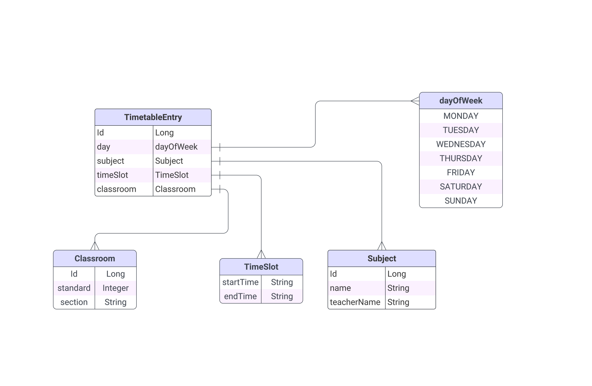

# School Timetable Management System

## Description
This project aims to develop a School Timetable Management System using Spring Boot and MySQL database. The system facilitates the creation, updating, retrieval, and deletion of timetable entries, classrooms, and subjects. It provides a user-friendly interface for authorized users to manage the school timetable efficiently.

## Models Involved
- Timetable Entry
- Classroom
- Subject

## Model Schema

## Requirements
- **Timetable Entry Model**:
    - Fields include ID (Auto Increment), subject, classroom, time slot, and day of the week.
- **CRUD Operations**:
    - Implement CRUD operations for Timetable Entry details respecting the relationships between Subject, Classroom, and Timetable Entry.
- **Classroom Model**:
    - Fields include classroom ID, section and standard.
- **Timetable Entry Listing by classroom**:
    - Provide a feature to list all timetable entries for a specific classroom.
- **Subject Model**:
    - Fields include subject ID, subject name, and teacher responsible.
- **Functionality**:
    - Assign subjects to specific time slots in the timetable.
- **Timetable Entry Listing by subjects**:
    - Support listing all timetable entries for a specific subject.

## Project Details
- **Architecture**:
    - Utilizes RESTful API architecture using Spring Boot for robustness and flexibility.
- **Database Integration**:
    - Integrates MySQL Database to store and manage data efficiently.
- **ORM**:
    - Employs Hibernate ORM for database interactions, ensuring simplified CRUD operations and data integrity.

## Getting Started
1. **Database Setup**:
    - Set up MySQL database and configure the application.properties file accordingly.
2. **Build and Run**:
    - Build the project using Maven and run the application.
3. **Access**:
    - Access the API endpoints through appropriate API client tools (e.g., Postman).

## Contributors
- Rudra Kumar Chauhan
- Narasimha
- Navneet
- Kanan Arora
- Karan Das A
- Utkersh

